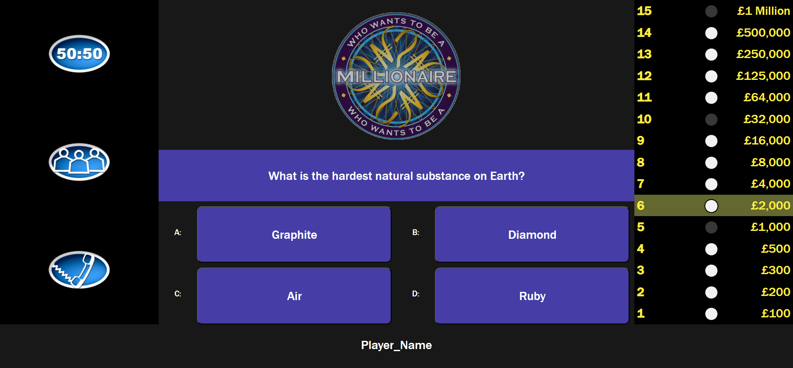
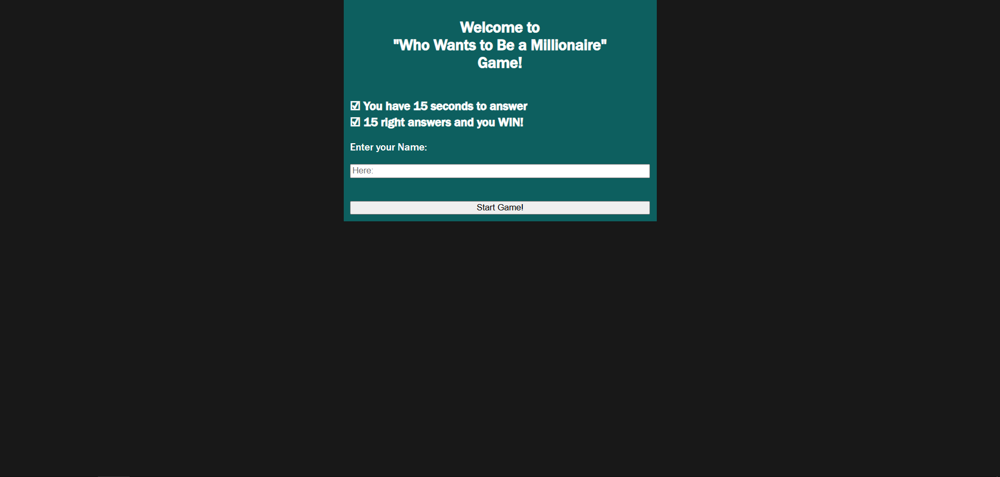
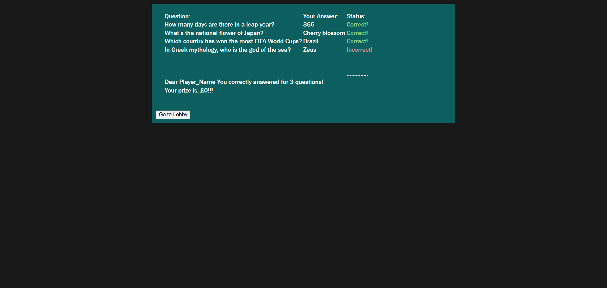

# 💸 Quiz-Game_js


```
A quiz game created using JavaScript, HTML and CSS inspired by television quiz show “Who Wants to Be a Millionaire?”.
```

---

## 📸 Screenshots

| Gameplay |
|:--------:|
|  |

---

| Welcome Page | Summary Page |
|:---------:|:--------:|
|  |  |

---

## 🧠 Game Rules

- The player's goal is to answer all 15 questions to win. 
- Every fifth question is a savepoint. 
- There is a time limit on the answer.
- At the end of the game the player can see a table of his answers.
- Questions and answers are randomized.

---

### ⬇️ Installation

```bash
git clone git@github.com:Albert-Tr-pp/Quiz-Game_js.git
cd Quiz-Game_js/js-quiz-game/welcome_page/
start welcome_page.html
```

---

## 📁 Project Structure

```
Quiz-Game_js/
├── js-quiz-game/
│   ├── img/...
│   ├── summary_page/...
│   ├── welcome_page/...
│   ├── index.html
│   ├── script.js
│   └── style.css
├── screenshots/
├── .gitignore
├── LICENCE
└── README.md
```

---

## ⚠️ License Notice

MIT License

Copyright (c) 2025 Albert Tromsa

---

## 📬 Contact

Feel free to reach out for questions or suggestions:

- Gmail: [tromsaalbert@gmail.com](mailto:tromsaalbert@gmail.com)
- GitHub: [github.com/Albert-Tr-pp](https://github.com/Albert-Tr-pp)

---

> 🧪 Keep learning by building! This project is a great foundation to explore Godot and game development.
